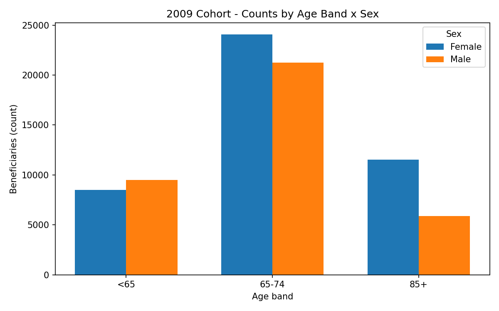
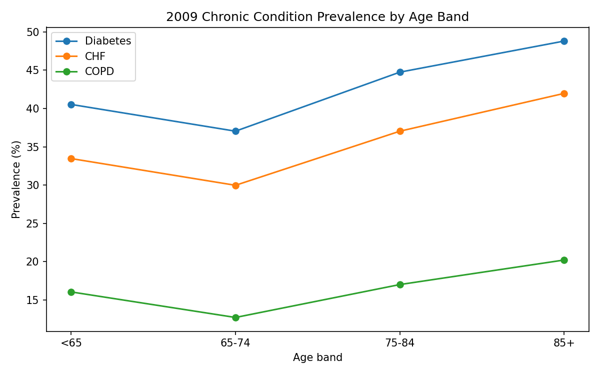

# Medicare SynPUF Mini-Audit Project

## Dataset
- Source: [CMS SynPUF](https://www.cms.gov/research-statistics-data-systems/synthetic-public-use-files-synpuf)
- Files used: Beneficiary Summary (2008–2010), Inpatient Claims (2008–2010, Sample 1)
- Disclaimer: This project replicates/extends SynPUF documentation for educational purposes. No PHI is used.

## Milestones
1. **Data loading**: DuckDB external views created from raw CSVs (`sql/01_load_raw.sql`).
2. **Sanity checks**: Row counts, null checks, date ranges (`sql/02_sanity.sql`).
3. **Cohort definition**: 2009 beneficiaries, enriched with age/sex/conditions (`sql/03_cohort.sql`).
4. **Descriptives**: Age × sex, condition prevalence, utilization (`sql/04_descriptives.sql`).
5. **Chase list**: Sampled 200 diabetes beneficiaries with claim checks (`sql/05_chase_list.sql`).
6. **Traceability & findings**: See `docs/traceability.md` and summary slides.

## Outputs
- `/data/clean/` → clean tables & descriptives (CSV exports).
- `/figures/` → optional charts.
- `chase_list_2009` → simulated RADV chase list, prioritized by missing/erroneous elements.

## Figures
- **Counts by Age Band × Sex (2009):** Distribution of the cohort across age bands, split by sex. Built from `data/clean/ageband_sex_counts_2009.csv`.  
  

- **Chronic Condition Prevalence (2009):** Diabetes/CHF/COPD prevalence by age band (percent). Built from `data/clean/prevalence_by_ageband_2009.csv`.  
  

## Traceability Matrix

| Requirement                           | Source columns                  | SQL/Logic (file)           | Validation                        | Output table/view         |
|---------------------------------------|---------------------------------|----------------------------|-----------------------------------|---------------------------|
| Cohort = 2009 beneficiaries           | Beneficiary Summary: DESYNPUF_ID | sql/03_cohort.sql          | Row count vs. raw file            | cohort_2009               |
| Add age, sex, chronic flags           | BENE_BIRTH_DT, SEX_IDENT_CD, condition flags | sql/03_enrichment.sql     | Age min/max, sex distribution     | cohort_2009_enriched      |
| Age × sex descriptives                | Derived age, sex_code            | sql/04_agebands.sql        | Counts by group sum to cohort size | ageband_sex_counts_2009   |
| Chronic condition prevalence          | DIABETES_FLAG, CHF_FLAG, COPD_FLAG | sql/04_conditions.sql     | Prevalence rates plausible        | chronic_prev_2009         |
| Utilization (IP/OP claims per person) | CLM_FROM_DT, DESYNPUF_ID         | sql/04_utilization.sql     | Avg claims >0, no null IDs        | utilization_avgs_2009     |
| Chase list generation (sample 200)    | DESYNPUF_ID, dates, dx flags     | sql/05_chase_list.sql      | Sample size=200, flags distribution | chase_list_2009          |
